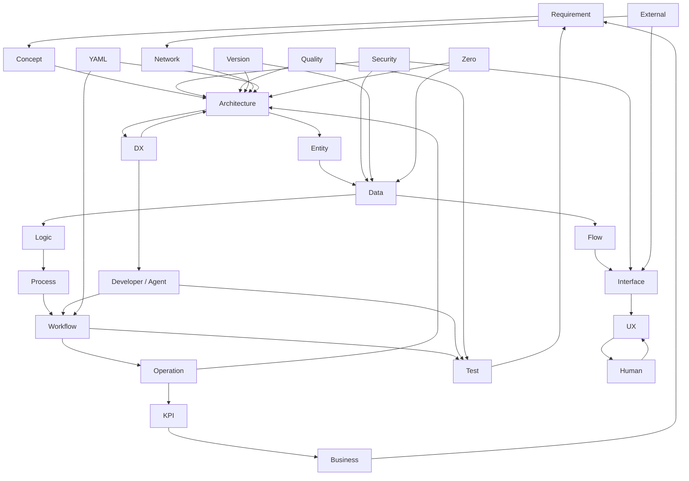

# A — Architecture

## Purpose
System全体の構造と、各要素の相互作用を定義する。

## Decision
- A–Zは26個の独立した箱ではなく、1つのSystemを観測するviewpointとする。
- Architectureを中心に、Business / Human / DX / UX / Security / Quality / Operation / Externalが横断的に作用する。
- DXは独立したA–Zの文字にはせず、Developer / Agent ExperienceとしてArchitectureの横断関心事に置く。
- UXはU viewpointとして、Userとの接点を扱う。

## Context
```text
                         Business
                            │
                            ▼
Requirement ───────► Architecture ◄────── Security
      │                    │  ▲                 │
      │                    │  │                 │
      ▼                    ▼  │                 ▼
   Concept              Entity ◄──────────── Quality
                           │
                           ▼
                         Data
                           │
                           ▼
                          Flow
                           │
             ┌─────────────┴─────────────┐
             ▼                           ▼
        Interface                       Logic
             │                           │
             ▼                           ▼
            UX                         Process
             │                           │
             ▼                           ▼
           Human                      Workflow
             │                           │
             └───────────┬───────────────┘
                         ▼
                      Operation
                         │
                         ▼
                       System
                         │
              ┌──────────┴──────────┐
              ▼                     ▼
             DX                   External
        Developer / Agent              │
              │                       │
              └───────────┬───────────┘
                          ▼
                        Test
                          │
                          ▼
                     Requirement
```

## Interaction Graph



## DX / UX

```text
                Architecture
                 /         \
                /           \
              DX             UX
               │              │
       Developer / Agent     User
               │              │
          Tooling/Flow     Interface
               │              │
               └──── System ──┘
```

- **Architecture**: Systemはどう分割され、どう接続されるか。
- **DX**: Developer / Agentがどう作り、変更し、検証し、運用するか。
- **UX**: Userがどう理解し、操作し、結果を受け取るか。

## Constraints
- A–Zの26 viewpointsは維持する。
- DXを27番目の文書分類にはしない。
- 相互作用はrelationとしてontologyに記録する。

## Alternatives
- DXをDにする案: Dataとの衝突があるため採用しない。
- DXを独立viewpointに追加する案: A–Z固定原則と矛盾するため採用しない。
- DXをcross-cutting concernとして扱う案: 採用。

## Consequences
- A2Zは「分類表」ではなく「相互作用グラフ」として読める。
- UXだけでなくDX、特にAgent-friendly DXをArchitectureから評価できる。
- Graph viewpoint (G) は、この関係を機械的に扱う中心的な観測点になる。

## Open Issues
- DXの評価指標をKPIとしてどこまで定義するか。
- AgentをHumanと同列のActorとして扱うか。
- Interaction GraphをJSON Schemaとして固定するか。
